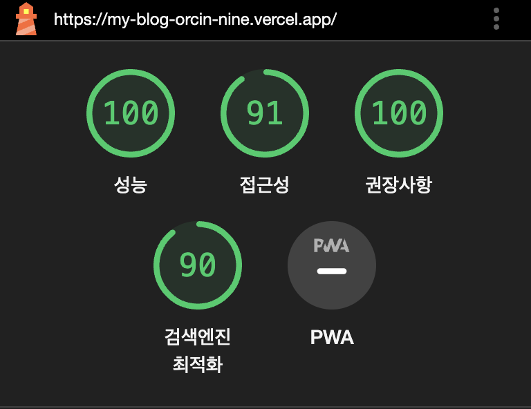

# 🖼️ NextBlog

My personal blog built with Nextjs, it uses Nodejs server

Built Site:  
[Kim's Devlog](https://my-blog-orcin-nine.vercel.app/)

## 🍳 Tech Stack

| Name       | Link                                                                   |
| ---------- | ---------------------------------------------------------------------- |
| Framework  | [NextJS](https://nextjs.org/docs)                                      |
| Markdown   | [react-md-editor](https://uiwjs.github.io/react-md-editor/)            |
| Server     | [NodeJs](https://nodejs.org/en/), [express](https://expressjs.com/ko/) |
| Deployment | [Vercel](https://vercel.com)                                           |
| Styling    | [Tailwindcss](https://tailwindcss.com/)                                |
| Database   | [MongoDB](https://www.mongodb.com/ko-kr)                               |

## 🌳 Project tree (~23.12.08)

```tree
📦 src
├── app
│   ├── (admin)
│   │   ├── admin
│   │   │   ├── page.tsx
│   │   │   └── write
│   │   │       ├── [slug]
│   │   │       │   └── page.tsx
│   │   │       └── page.tsx
│   │   └── login
│   │       └── page.tsx
│   ├── [...not_found]
│   │   └── page.tsx
│   ├── about
│   │   └── page.tsx
│   ├── favicon.ico
│   ├── globals.css
│   ├── layout.tsx
│   ├── page.tsx
│   └── posts
│       ├── [slug]
│       │   ├── error.tsx
│       │   └── page.tsx
│       └── page.tsx
├── components
│   ├── DarkMode.tsx
│   ├── DarkModeProvider.tsx
│   ├── DeleteButton.tsx
│   ├── Eduitor.tsx
│   ├── Footer.tsx
│   ├── Header.tsx
│   ├── Logout.tsx
│   ├── MarkdownContents.tsx
│   ├── PostCard.tsx
│   ├── Profile.tsx
│   ├── TagInputComponent.tsx
│   ├── Toc.tsx
│   └── TypoWrite.tsx
├── context
│   └── AuthContext.tsx
├── features
│   └── auth
│       └── userSlice.ts
├── middleware.ts
│
├── types
│   └── post.ts
└── utils
    ├── firebase.ts
    ├── firestorage.ts
    ├── printDate.ts
    └── useIntersectionObserver.tsx
```

## Google Lighthouse performance statistics



## 🙏 Referenced sites

[BlogToc](https://thisyujeong.dev/blog/toc-generator)
